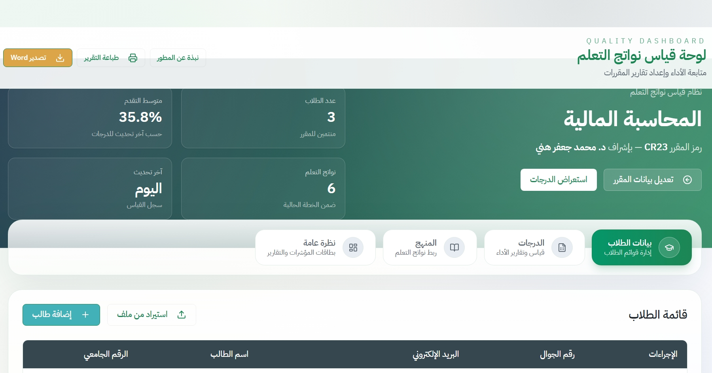

# Grade Outcomes Dashboard



Grade Outcomes Dashboard is a bilingual (Arabic/English) quality monitoring tool for higher-education courses. It centralises student rosters, assessment plans, grades, course learning outcomes (CLOs), and auto-generated Word reports so faculty can track progress, analyse achievement, and share structured evidence with quality assurance teams.

## Key Features

- **Interactive analytics** – Overview tab highlights enrolment, pass/fail ratios, top performers, assessment mastery, and CLO coverage using Recharts visualisations.
- **Students & assessments management** – Add/edit/delete students, build assessments with nested questions, and keep grade fields aligned automatically.
- **Flexible imports** – Upload student lists from CSV/TXT/XLS/XLSX and grade books from Excel; data is normalised to match the configured assessment structure.
- **CLO tracking** – Maintain the syllabus CLO list with weights while keeping the data synced across the dashboard and exports.
- **Rich Word exports** – Generate DOCX files (via [`docx`](https://www.npmjs.com/package/docx)) that now include structured sections, tables, CLO coverage, and capped student lists.
- **Responsive UI** – Right-to-left optimised layout built with Tailwind CSS, shadcn/ui primitives, and custom theming.

## Tech Stack

- **Frontend**: React 18, Vite, TypeScript, Tailwind CSS, shadcn/ui, Recharts
- **State & Utilities**: TanStack Query, custom hooks, docx
- **Backend**: Express (for `/server`) with TypeScript build via esbuild
- **Tooling**: ESLint/TypeScript (`npm run check`), Drizzle ORM config, PostCSS

## Project Structure

```text
c:/Grade_CalcMoha
├── client/                # React dashboard (Vite)
│   ├── src/components/    # UI components, tables, cards, export header
│   ├── src/pages/         # Page-level containers (Home, Setup, 404)
│   ├── src/lib/           # Shared helpers (report export data store)
│   └── src/types/         # Shared TypeScript types
├── server/                # Express API bootstrap (optional)
├── shared/                # Shared schema definitions
├── Screenshot.jpeg        # UI preview used in README
└── README.md              # Project documentation
```

## Prerequisites

- Node.js 18+
- npm 9+

## Setup & Installation

1. **Install dependencies**
   ```bash
   npm install
   ```
2. **Configure environment** (if using the server): create `.env` with database/session configuration following your deployment needs.
3. **Populate course info**
   - Visit `/setup` to enter course metadata (module code, professor, etc.).
   - The data is stored locally (browser `localStorage`).

## Running the Project

| Command | Description |
|---------|-------------|
| `npm run dev` | Starts the Express server with Vite middleware (development). |
| `npm run check` | Runs the TypeScript compiler on server & client for type safety. |
| `npm run build` | Generates a production build (Vite client + bundled server). |
| `npm start` | Serves the bundled Express app from `dist/` (production). |

> The React dashboard is accessible via the Express dev server. If you prefer a standalone client run, execute `npm install` and `npm run dev` inside the `client/` folder to use Vite's preview server.

## Data Import Guides

### Students Import (CSV / TXT / XLS / XLSX)

The students table accepts files with four columns: `studentId`, `name`, `email`, `phone`. The first row can be a header (auto-detected). Example CSV content:

```csv
studentId,name,email,phone
202301001,أحمد محمد,ahmed@example.com,0501234567
202301002,فاطمة سعيد,fatima@example.com,0509876543
```

Excel files should follow the same column order.

### Grades Import (Excel)

Match the following template to align with your configured assessments and questions:

```
Row 1: Assessment labels repeated per question (e.g., "اختبار 1")
Row 2: Question labels (e.g., "س1", "س2")
Row 3: CLO codes (optional)
Row 4+: Student data rows: studentId, studentName, grade1, grade2, ...
```

> **Important**: Create your assessment & question structure inside the app before importing grades. The importer iterates through existing assessments/questions to map grade columns to the correct keys.

## Word Export Content

The export button in the header generates a DOCX file containing:

- Course & instructor metadata
- Summary statistics (students count, average achievement, pass rate, CLO coverage)
- Pass/fail breakdown table
- Top grade table (capped at 10 students)
- Assessment performance table (percentage mastery)
- Student roster (capped at 25 entries with notice)
- Assessment/question overview
- CLO table with weights

If structured data is unavailable, the exporter falls back to the rendered DOM sections so the report always contains at least the visible text and tables.

## Testing & Quality

- `npm run check` ensures both server and client TypeScript code compile cleanly.
- ESLint or formatting steps can be added via VS Code or a pre-commit hook if desired.

## Contributing & Customisation

- Tailwind theme tokens live in `tailwind.config.ts` and `client/src/index.css`.
- Add or tweak components under `client/src/components/ui` using shadcn/ui patterns.
- Extend export data in `client/src/lib/reportExport.ts` if you introduce new dashboard sections.

## License

This project is released under the MIT License. See [LICENSE](LICENSE) if provided, or add one to set distribution terms.
